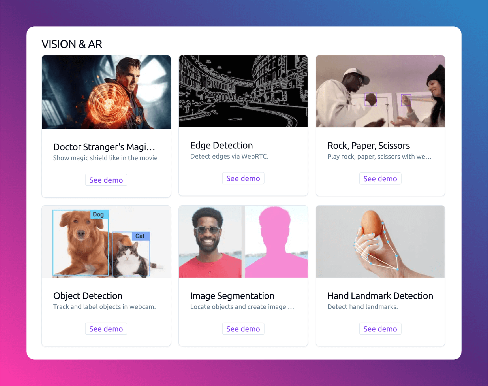

# Next Web ML

## Introduction
This repo is backend part of [Next Web ML](https://next.regulusai.top/).

[Next Web ML](https://next.regulusai.top/) is a website demonstrating and exploring the AI applications built with web technology, providing features like Object Detection, AR effect through WebRTC etc. Built with Next.js, Tensorflow.js and Mediapipe, it leverages modern web technologies with machine learning to deliver a seamless user experience.



## Features
- Object Detection with model run in local browser
- Image Segmentation with model run in local browser
- Hand Landmark Detection with model run in local browser
- Rock,Paper,Scissors Hand Gesture Detection with model run in local browser
- Magic Shield AR Effect based on WebRTC with [Backend](https://github.com/satorioh/next_web_ai_backend)
- Edge Detection based on WebRTC with [Backend](https://github.com/satorioh/next_web_ai_backend)

## Prerequisites
Before you begin, ensure you have met the following requirements:
- python,redis and pdm installed
- A modern web browser

## Installation
To install, follow these steps:

1. Clone the repository:
   ```bash
   git clone https://github.com/satorioh/next_web_ai_backend.git
2. Navigate to the project directory:<pre>cd next_web_ai_backend </pre>
3. Install the dependencies:<pre>pdm install </pre>

## Usage
To run, execute the following command:
```
pdm start
```
This will start the development server and localhost:8000.

